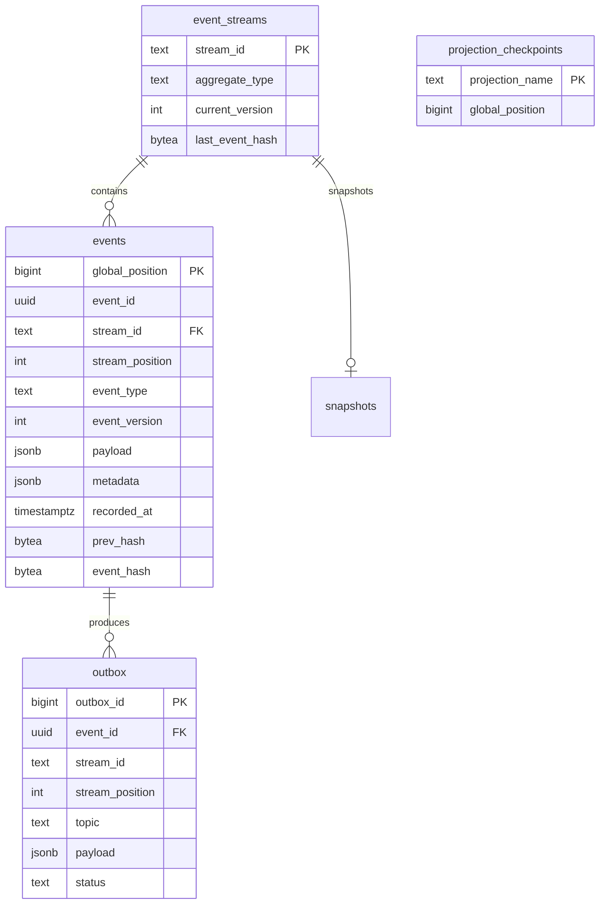
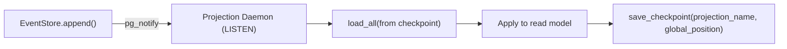
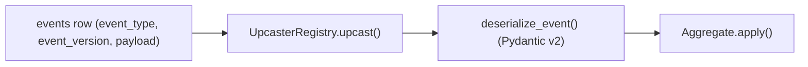

# The Ledger — Event-Sourced, Multi-Agent Loan Decisioning (Phase 0–2)

## Goals
- **Auditability**: every state transition is derived from immutable events.
- **Replayability**: every agent execution is reconstructible from an agent session stream.
- **Temporal queries**: projections can rebuild from `events.global_position` checkpoints.
- **Verifiability**: events carry a per-stream cryptographic hash chain.

Non-goals (Phase 0–2): production decision policies, real document/registry integrations, advanced agent reasoning.

---

## Aggregate Boundaries (DDD)

| Aggregate | Stream ID pattern | Source-of-truth state |
|---|---|---|
| `LoanApplication` | `loan-{application_id}` | application lifecycle + decision outcomes |
| `DocumentPackage` | `docpkg-{application_id}` | document intake + extraction lifecycle |
| `AgentSession` | `agent-{agent_type}-{session_id}` | replay-safe agent run timeline |
| `CreditRecord` | `credit-{application_id}` | credit analysis outputs |
| `FraudScreening` | `fraud-{application_id}` | fraud screening outputs |
| `ComplianceRecord` | `compliance-{application_id}` | deterministic rule results + verdict |
| `AuditLedger` | `audit-{entity_id}` | integrity check runs / chain attestations |

---

## Event Sourcing + CQRS
- **Writes**: append-only to `events` (log-as-truth).
- **Reads**: aggregates rebuild via `load_stream()`; projections rebuild via `load_all()` ordered by `global_position`.
- **CQRS**: write model is the event log; read models are projection tables (not required yet beyond checkpoints).

---

## PostgreSQL Schema (Phase 0)
Canonical schema lives in `schema.sql`.

### Tables
- `event_streams`: stream head (`current_version`, `last_event_hash`)
- `events`: immutable append-only event log with total order `global_position`
- `outbox`: publishable messages written in the same transaction as events
- `snapshots`: optional read optimization (not required for correctness)
- `projection_checkpoints`: per-projection `global_position` cursor

### ER Diagram

---

## Optimistic Concurrency Control (OCC)
### Invariants
- A stream’s version is **the last written `stream_position`**.
- Appends must supply `expected_version` that matches `event_streams.current_version`.
- If mismatched, `OptimisticConcurrencyError` is raised and callers decide whether/how to retry.

### Strategy
`EventStore.append()` executes in a single transaction:
1. `INSERT ... ON CONFLICT DO NOTHING` for `event_streams` (ensures stream row exists).
2. `SELECT ... FOR UPDATE` on `event_streams` row (serializes concurrent writers per stream).
3. Compare `current_version` to `expected_version` (strict OCC).
4. Insert N events, updating the per-stream hash chain (`prev_hash` → `event_hash`).
5. Insert matching `outbox` rows for each event (same transaction).
6. Update stream head (`current_version`, `last_event_hash`).
7. `pg_notify('ledger_events', ...)` for projection daemons.

### Retry policy
- OCC mismatches are **not retried** in `EventStore`; they are surfaced to callers.
- Transient DB errors (serialization / deadlocks / unique conflicts) are retried with exponential backoff.

---

## Cryptographic Verifiability (Hash Chain)
- Each event stores `prev_hash` and `event_hash`.
- `event_hash = SHA256(canonical_json(event_fields + prev_hash))`
- `event_streams.last_event_hash` is the head pointer.

Verification: replay a stream in `stream_position` order and recompute `event_hash`, checking it matches the stored `event_hash` and links via `prev_hash`.

---

## Outbox Guarantees
- Outbox rows are written **in the same transaction** as events.
- Ordering is preserved per stream via `(stream_id, stream_position)`.
- Consumers should process outbox rows in `(stream_id, stream_position)` order (or globally by `created_at/global_position` depending on transport).

---

## Projection Flow (Realtime + Checkpointing)
Projections are consumers of the immutable log:
1. LISTEN on `ledger_events`.
2. On notification, read events from `events` ordered by `global_position` starting at checkpoint.
3. Apply to read model(s).
4. Persist checkpoint in `projection_checkpoints`.

---

## Upcasters (Versioned Events)
- Upcasters run **only on read** (load/replay), never on append.
- `ledger/upcasters.py` provides a registry that upgrades old payloads to the current schema version.

Flow:

---

## Agent Execution Lifecycle (Replay-Safe Logging)
Each agent run writes to an `agent-{agent_type}-{session_id}` stream:
1. `AgentSessionStarted`
2. `AgentInputValidated` / `AgentInputValidationFailed`
3. For each node: `AgentNodeExecuted`
4. For each tool call: `AgentToolCalled`
5. `AgentOutputWritten`
6. `AgentSessionCompleted` / `AgentSessionFailed`

The node sequence is deterministic and the `AgentSession` aggregate enforces contiguous `node_sequence`.

---

## Key Files
- `schema.sql`: PostgreSQL schema
- `init_db.py`: idempotent DB initializer
- `ledger/event_store.py`: asyncpg EventStore + InMemoryEventStore
- `ledger/schema/events.py`: canonical Pydantic event models (strict + frozen)
- `ledger/domain/aggregates/*.py`: deterministic replay aggregates
- `ledger/agents/base_agent.py`: async LangGraph agent framework (Phase 2)

