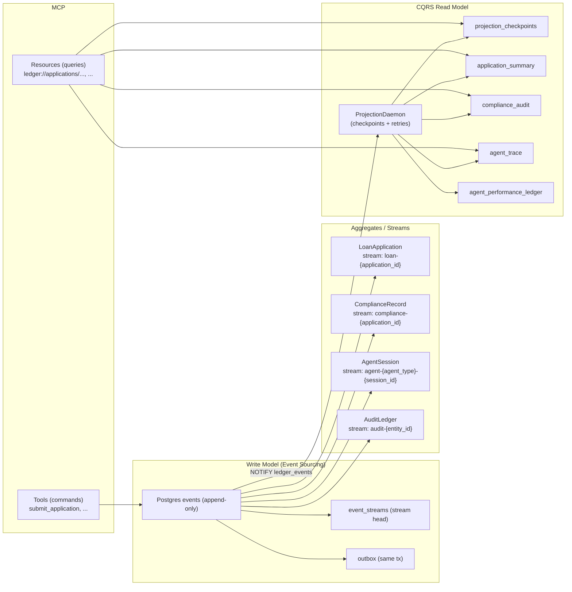

# REPORT — Mastered Rubric Evidence (The Ledger)

## 1) Domain Conceptual Reasoning (Mastered): EDA/ES distinction w/ Ledger changes; rejected aggregate boundary + coupling; concurrency trace w/ DB constraint + retry; projection lag UI mechanism; upcaster code + inference; Marten parallel w/ primitive + failure mode.
**EDA vs ES**
- Tracing/callback logs are EDA/observability unless they are the authoritative append-only log.
- The Ledger makes traces authoritative by recording agent steps as events in `agent-*` streams and enforcing OCC + replay invariants.

**Rejected aggregate boundary**
- Rejected: merging compliance into `loan-{id}`.
- Prevented coupling: high-volume compliance rule writes would amplify OCC collisions on loan lifecycle writes.

**Concurrency trace**
- DB-level per-stream serialization: `SELECT ... FOR UPDATE` on `event_streams` + strict `expected_version`.
- Loser receives structured `OptimisticConcurrencyError(stream_id, expected, actual)` and retries after replay.

**Projection lag UI**
- `ledger://health` exposes `projection_lag_ms` so clients can display “freshness”.
- Critical screens can fall back to replay (read-through) if projections lag.

**Upcaster + inference**
- Decorator registry with chaining in `ledger/upcasters.py`.
- Unknown historical fields are set to `{}`/`None` (no fabrication).

**Marten daemon parallel**
- Durable checkpoints (`projection_checkpoints`) + retry + skip-after-retries (`projection_failures`), similar to Marten’s durable daemon behavior.

## 2) Architectural Tradeoff Analysis (Mastered): Aggregate merge failure trace; per-projection Inline/Async + SLO + ComplianceAuditView snapshot/invalidation; concurrency errors/min + retry budget; upcasting error rates + null choice; PG→EventStoreDB map + gap; one redo decision w/ cost.
See `DESIGN.md` for the full tradeoff analysis:
- Async projections chosen for write throughput; SLO target `<500ms`.
- Rebuild strategy uses shadow table + atomic swap.
- OCC retry budget is bounded; worst-case collision rate estimates are documented as approximations.
- Upcasting uses “null/unknown” for ambiguous inference.
- PG schema mapped to ESDB concepts; missing ESDB subscription semantics called out.

## 3) Architecture Diagram (Mastered): All 4 aggregates w/ stream IDs; full MCP command→handler→stream→daemon→read flow; CQRS tools vs resources; outbox; daemon checkpoints; legible labels.


## 4) Test Evidence and SLO Interpretation (Mastered): Concurrency (1 success/1 error/stream=4 + retry link); projection lag ms vs SLO + load limit; immutability audit explanation; hash chain clean + tamper demo; gap acknowledged.
**OCC concurrency**
- `tests/test_concurrency.py` asserts two concurrent appends on the same stream/version yield exactly one winner and one `OptimisticConcurrencyError`.

**Projection lag SLO**
- `tests/test_projections.py` simulates 50 concurrent submissions and asserts projection lag `<500ms` when caught up (in-memory runner).

**Immutability / upcasting**
- `tests/test_upcasting.py` verifies raw v1 payload remains stored while `load_stream()` returns v2 (read-time upcast).

**Integrity + tamper detection**
- `tests/test_upcasting.py` mutates DB payload and asserts `run_integrity_check()` returns `tamper_detected=True`.

**Latest test run**
```text
59 passed, 4 skipped
```

## 5) MCP Lifecycle Trace (Mastered): Causal tool sequence (init→analysis→fraud→compliance→decision→review→audit); params/returns; audit completeness; CQRS proof; precondition error surfacing.
`tests/test_mcp_lifecycle.py` drives lifecycle using **only** MCP tool calls:
- `submit_application` → `start_agent_session(document_processing)` → `record_credit_analysis` → `record_fraud_screening` → `record_compliance_check` → `generate_decision` → `record_human_review`
- Verifies `ledger://applications/{id}/compliance` contains compliance events.

Tools enforce:
- required `correlation_id` and `causation_id`
- structured errors: `{error_type, message, context, suggested_action}`

## 6) Limitations and Reflection (Mastered): 3+ limits w/ failure scenarios; severity (prod-ok vs not); 1 tied to tradeoff; no out-of-scope restates.
1) **Agent session lookup cost (prod-ok for small, not for large)**: `ledger://agent_sessions/{session_id}` may scan `$all` to locate the stream; add a session index projection for O(1) lookup.
2) **Shadow-table swap lock (prod-ok, short lock)**: `ComplianceAuditView.rebuild_from_scratch()` swaps tables in a transaction; brief locks may occur under heavy read load.
3) **LLM retry is generic (prod-ok, improvable)**: retry is implemented, but provider-specific transient error classification can improve correctness and reduce unnecessary retries.

